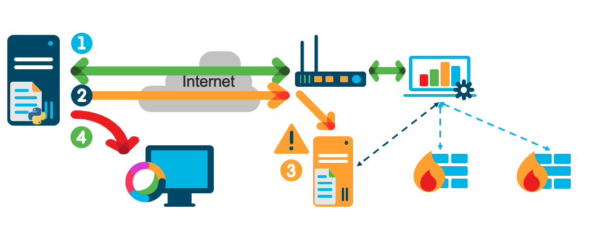

# GVE_DevNet_FTD_SysLog_Monitoring_System
A back-end script created to monitor the Syslog of a FTD HA Pair. 
The script is configured to monitor for a specific Syslog message that specifies an error may have occurred. 
If the message is found, the Network Admin is notified to take action.

## Contacts
* Alexander Hoecht
* Alex Hansen

## Solution Components
* Python 3 [Download latest version](https://www.python.org/downloads/)
* Cisco FMC
* Cisco FTD (configured in an HA Pair)
* Ubuntu Server (loaded with RSYSLOG)
* Cisco Webex ChatBot (configured [HERE](https://developer.webex.com/my-apps/new))
    * NOTE: Retrieve Webex Person ID [HERE](https://developer.webex.com/docs/api/v1/people/get-my-own-details)

## Install Requirements
Steps needed to install the dependencies for the project environment
```
# Create a Virtual Environment
python3 -m venv Virtual_Environment

# Activate Virtual Environment
source Virtual_Environment/bin/activate # (MacOS)
Virtual_Environment/Scripts/activate # (Windows)

# Install Dependencies
pip install -r requirements.txt
```

## Configuration
Input the following information to configure application
```python
# In mainapp.py 
# Set Syslog configuration
SYSLOG_HOSTNAME = ''
SYSLOG_USERNAME = ''
SYSLOG_PASSWORD = ''


# In bot.py
# WebEx API Bot Setup
BASE_URL = 'https://webexapis.com/v1'
BOT_NAME = ''
BOT_USERNAME = '@webex.bot'
BOT_ID = ''
BOT_ACCESS_TOKEN = ''
# Webex Person ID used for Direct reporting
PERSON_ID = ''
```

## Running the Application
Once Dependencies are installed to Environment:
```
# Start the application
python3 mainapp.py

# Input FMC Connection Arguments
Input FMC hostname (FQDN or IP) []: AAA.BBB.CCC.DDD
Input FMC Username []: FMC_USERNAME
Input FMC Password []: FMC_PASSWORD

# On Successful FMC Connection
Input the ID of the HA pair to manage []: HA_PAIR_ID
```

# High-Level Diagram


### LICENSE

Provided under Cisco Sample Code License, for details see [LICENSE](LICENSE.md)

### CODE_OF_CONDUCT

Our code of conduct is available [here](CODE_OF_CONDUCT.md)

### CONTRIBUTING

See our contributing guidelines [here](CONTRIBUTING.md)

#### DISCLAIMER:
<b>Please note:</b> This script is meant for demo purposes only. All tools/ scripts in this repo are released for use "AS IS" without any warranties of any kind, including, but not limited to their installation, use, or performance. Any use of these scripts and tools is at your own risk. There is no guarantee that they have been through thorough testing in a comparable environment and we are not responsible for any damage or data loss incurred with their use.
You are responsible for reviewing and testing any scripts you run thoroughly before use in any non-testing environment.